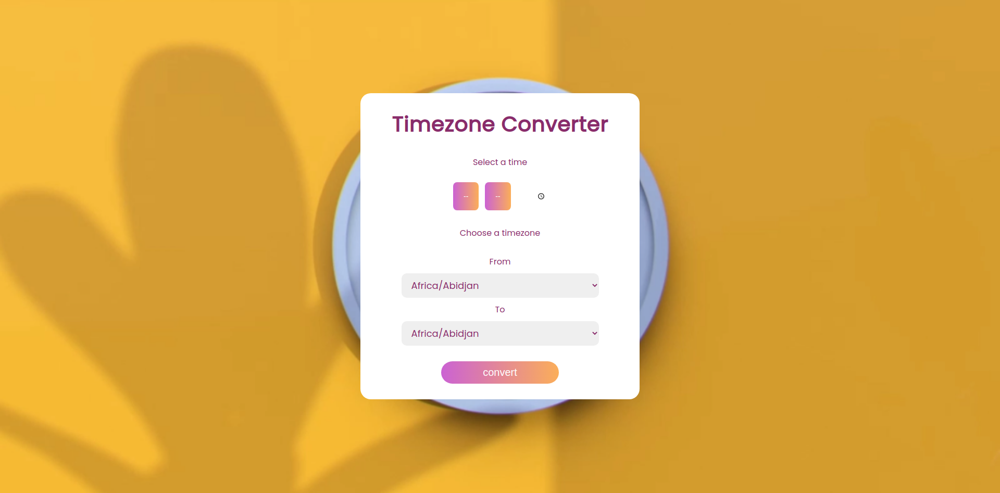
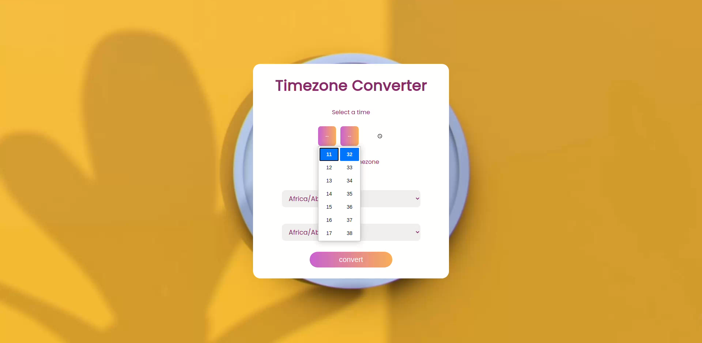
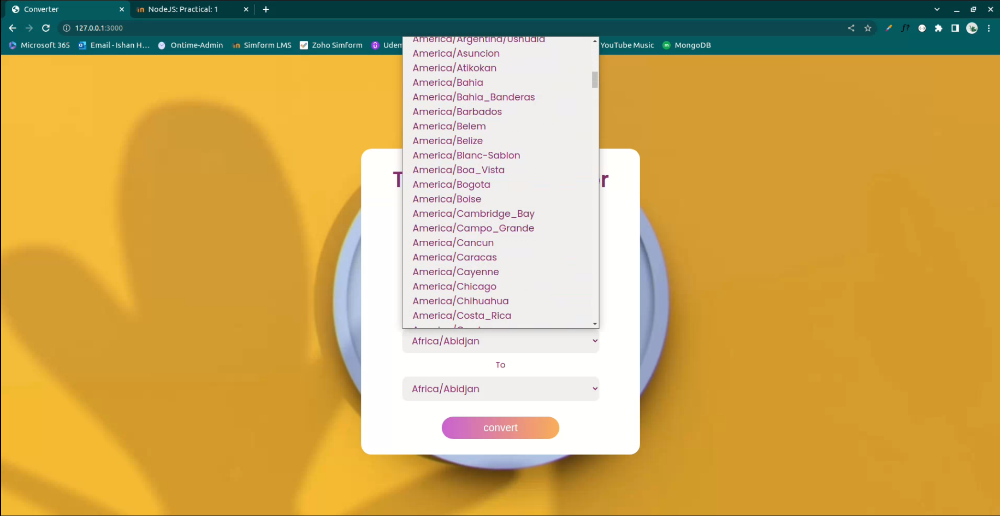
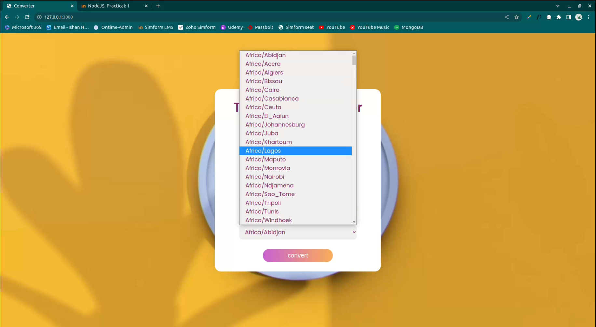
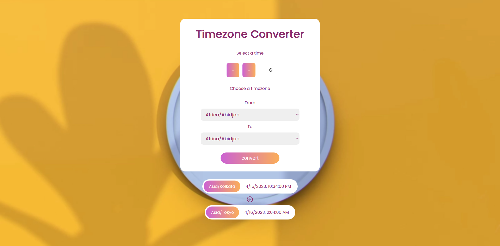
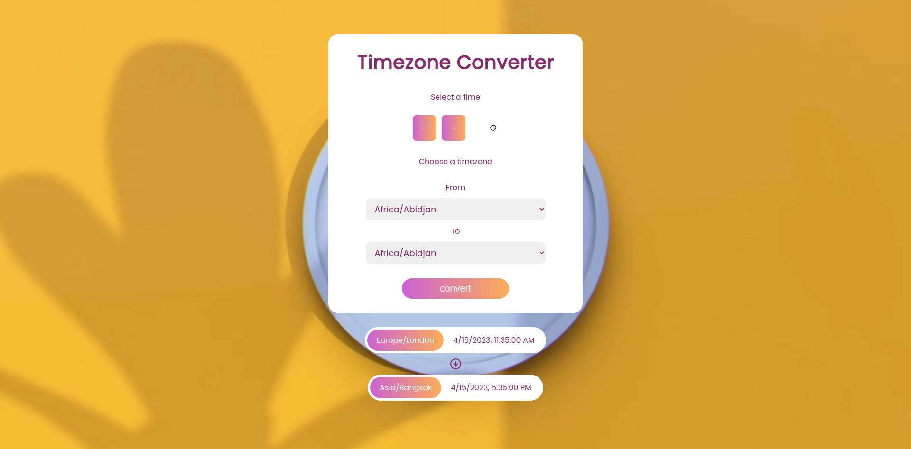
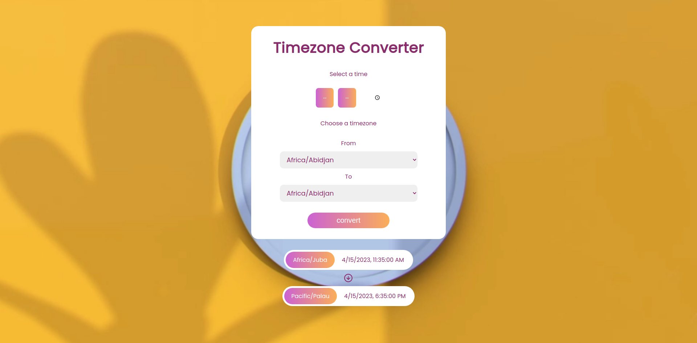

# practical_2

## 📝 Table of Contents

- [AIM](#aim)
- [Usage](#usage)
- [Output](#output)

 

## 🏁 AIM 

Create a NodeJS program/Script which accept the time inputs, and convert the current time to the given Timezone.

 

> ### ⛏️ Dependencies

- EJS
- Express

 

## 🎈 Usage 
Clone the repo using below command: 
<code>$ git clone (web URL)</code> 

 

Then open the terminal and run the below command: 
<code>$ nodemon index.js</code> 

 

and then go to "localhost:3000" in your browser to see the output.
 

 

## 🎉 Output 

### Possible outputs
<pre>
Input:

CURRENT_TIME          : Current Time / Dynamic input
CURRENT_TIMEZONE      : Timezone of the CURRENT_TIME
CONVERT_TO_TIMEZONE   : Timezone which wanted to convert to

Output:
CONVERTED_TIME      = '10:30 AM'
</pre>
 

<ol>
    <li>Home Page</li> 
      
    <li>First select time</li> 
      
    <li>Then select source timezone</li> 
      
    <li>Then select destination timezone</li> 
      
    <li>Then press "convert" button to see output</li> 
    <li>outputs</li> 
    <ul>
        <li>output1</li> 
          
        <li>output2</li> 
          
        <li>output3</li> 
          
    </ul>
</ol>

##  ✍️ Author: ISHAN HARKHANI